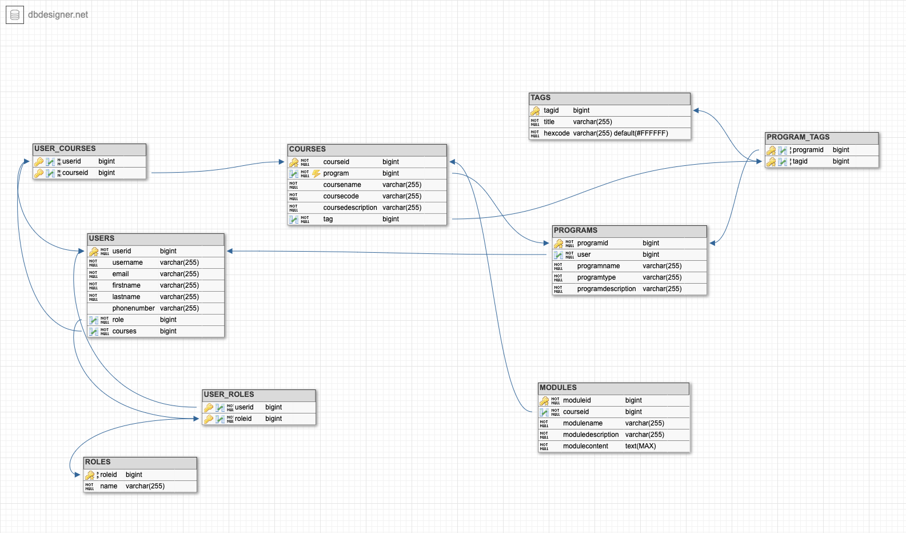

# Reach LMS Backend — Java | Spring Boot | REST

- [Reach LMS Backend — Java | Spring Boot | REST](#reach-lms-backend--java--spring-boot--rest)
    * [Introduction](#introduction)
    * [Understanding the Product](#understanding-the-product)
        + [Big Picture](#big-picture)
        + [Current Development](#current-development)
        + [Curriculum Hierarchy](#curriculum-hierarchy)
            - [Programs](#programs)
            - [Courses](#courses)
            - [Modules](#modules)
            - [Tags](#tags)
        + [Types of Users and their Permissions](#types-of-users-and-their-permissions)
            - [ADMIN](#admin)
            - [TEACHER](#teacher)
            - [STUDENT](#student)
    * [Understanding this Backend](#understanding-this-backend)
        + [What does it do? This backend can...](#what-does-it-do-this-backend-can)
        + [What do we value? This backend strives to...](#what-do-we-value-this-backend-strives-to)
    * [Database Design](#database-design)
        + [Database Schema](#database-schema)
        + [Models](#models)
        + [Tables](#tables)
    * [RESTful Design](#restful-design)
        + [HATEOAS](#hateoas)
    
---

## Introduction

Reach LMS is an open-source learning management system designed for the developing world. Reach lets organizations offer
education and training to anyone—whether they're working from a laptop in a city center or a solar-charged flip phone in
a remote village.

This repository contains the source code for the RESTful Java Spring Boot backend application that drives the creation,
storage, and access of data that drive this product.

---

## Understanding the Product

### Big Picture

Reach LMS is intended to serve as a general-purpose, open-source Learning Management Systems for various educational
circumstances. Our goal is to provide users with an infrastructure wherein they can design curriculum however they see
fit and serve that curriculum to any sort of student body. Whether it be an online school for coders across the US or a
training program aimed to enable women in rural Africa to trade legally, safely, and profitably... Reach LMS aims to
provide the backbone for any organization to create, manage, and distribute educational curricula of every shape and
size.

Long-term, we hope to provide users with the following:

1. Complete agency over how their content is organized, formatted, and shipped; this would hopefully include large-scale
   control over the hierarchy of various resources
1. Flexible control over groups of users all the way down to granular permissions for what each user specifically can
   and cannot do to any content in the system
1. Support for Assignments, Grades, and Graduation Lifecycles
1. Support for User Management Lifecycles from user on-boarding to editing user's roles or outright blocking user access
1. Incredibly fast response times of all media from the Database to the End-User, whether that user is on a desktop or
   solar-charged mobile phone.

### Current Development

This product has spent the last two months building up, breaking down, and refining an incredible foundation for future
developers to build upon.

The last two months have focused on developing a powerful foundation for the following broad-strokes features:

- Building a base-level hierarchy for educational content
- User Authentication: Sign-Up, Log-In, Deletion, Profile-Updates; integration with Okta
- Designing role-based interaction with educational content that grants various operations and resources to users based
  on their role. This includes the creation, editing, deleting, or viewing of any content in the curriculum hierarchy.
- Coherent and flexible relationships between any users and any entities in the curriculum hierarchy.

### Curriculum Hierarchy

We have designed the following hierarchy to define what educational curriculum should look like to start out:

#### Programs

Programs should contain the following fields:

- `programname` — The name of the program
- `programtype` — K-12, Higher Education, Training, etc.
- `programdescription` — A description of this program's focus; what does it teach?, who is it for?, etc.
- `user` — An ADMIN who claims "ownership" over this program.
- `courses` — A collection of courses that belong to this program
- `tags` — A collection of ADMIN-defined tags that represent the possible sub-categories for courses in this program.

#### Courses

Courses should contain the following fields:

- `coursename` — The name of the course
- `coursecode` — A natural identifier — a unique text field that allows creators to control how a course is identified
- `coursedescription` — A description of this course—what does it teach? who does it teach?
- `program` — The program to which this course belongs
- `users` — A collection of users "enrolled" in this course. This set will include both TEACHER and STUDENT users
    - TEACHER and STUDENT users are differentiated by their role, not a separate join table
- `modules` — A collection of modules that belong to this course
- `tag` — A tag selected from the list defined of available tags set by the ADMIN when creating the Program to which
  this course belongs.

#### Modules

Each Module should contain the following fields:

- `modulename` — The name of the module
- `moduledescription` — A description that gives an overview of what this module focuses on
- `modulecontent` — Markdown content that contains all the learning content in this module
- `course` — The course to which this module belongs

#### Tags

The first step towards user-defined hierarchies... an ADMIN has the ability to define a group of Tags for a program.
Each Tag will have a simple `title` and `hexCode` to represent the name of this tag and the associated color.

For example, if I were to go create a program called "Web Development," I might opt to keep my number of tags slimmer:

- Frontend
- Backend
- Computer Science

Or, maybe I'd prefer to have a BUNCH of different tags, like so:

- Frontend
- Backend
- Computer Science
- React
- State Management
- Java
- Spring Boot
- NodeJS

Either way I prefer it as the admin, I can make all these tags. Then, each course that belongs to this program could
specify a tag with which it should be associated.

### Types of Users and their Permissions

#### ADMIN

#### TEACHER

#### STUDENT

---

## Understanding this Backend

### What does it do? This backend can...

- Authenticate users with Okta, Spring Security, and JWTs
- Authorize resources dependent on the Roles, Scopes, and/or Okta Groups that the user belongs to
- Send resources through various endpoints
- Attach relational links to resources based on (1.) who requested it and (2.) the resource itself

### What do we value? This backend strives to...

- Maintain backwards compatibility by thoughtfully evolving the API and supporting fields/operations/endpoints long-term
  so that clients need not worry about updating code
- Drive application state via hypermedia links
- Keep response data nesting to a minimum to provide faster serialization
- Clearly define relationships between entities through the use of hypermedia links rather than documentation alone or
  knowledge of this source code
- Organize user privileges and agency based upon their role

---

## Database Design

### Database Schema

### Models

This database schema includes the following models:

- `User`
- `Roles`
- `Program`
- `Course`
- `Module`
- `Tags`

### Tables

The aforementioned models are organized into the following tables:

- `USERS`
    - Every user in this system will be either an ADMIN, TEACHER, or STUDENT
- `ROLES`
    - ADMIN, TEACHER, or STUDENT are the primary role types for this application
- `PROGRAMS`
    - The parent of the Program > Course > Module curriculum hierarchy
- `COURSES`
    - The middle child of the Program > Course > Module curriculum hierarchy
- `MODULES`
    - The smallest child in the Program > Course > Module curriculum hierarchy
- `TAGS`
    - ADMIN users can create "tags" for any given Program that act as the possible sub-categories for that program
    - Each course in that Program will then have the ability to "belong to" one specific Tag that exists in the
      categories ("ProgramTags") defined for that Program
- Explicit Join Tables:
    - `PROGRAM_TAGS` — Joins Many PROGRAMS to Many TAGS in a MANY to ONE to MANY relationship
        - Though not an explicit table, it's worth noting that Courses have a Many COURSES to One PROGRAM_TAG
          relationship with this table
    - `USER_COURSES` — Joins Many USERS to Many COURSES in a MANY to ONE to MANY relationship
        - Users in this table belong to the role of TEACHER or STUDENT, as ADMINS are not attached at the course-level.
    - `USER_ROLES` — Joins Many ROLES to Many USERS in a MANY to ONE to MANY relationship

All tables will have the columns pictured in the schema above; additionally, each table will contain the following
auditing fields:

- `CREATED_BY` - The user that first created it
- `CREATED_DATE` — The timestamp for when it was first created
- `LAST_MODIFIED_BY` — The user that last edited it
- `LAST_MODIFIED_DATE` — The timestamp for when it was first created

---

## RESTful Design

### HATEOAS
