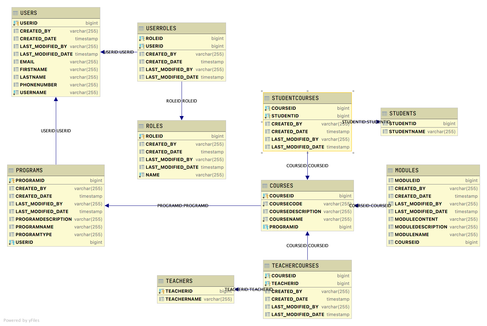

# Reach LMS Backend — Java | Spring Boot | REST

## Table of Contents

- [Introduction](#introduction)

- [RESTful Design](#RESTful-design)
  - [HATEOAS](#hateoas)
    
- [Sample Endpoint Calls](#sample-endpoint-calls)

<a name="introduction"></a>

## Introduction

Reach LMS is an open-source learning management system designed for the developing world. Reach lets organizations offer education and training to anyone—whether they're working from a laptop in a city center or a solar-charged flip phone in a remote village.

This repository contains the source code for the RESTful Java Spring Boot backend application that drives the creation, storage, and access of data that drive this product. 

### What does it do? This backend can...

- Authenticate users with Okta, Spring Security, and JWTs
- Authorize resources dependent on the Roles, Scopes, and/or Okta Groups that the user belongs to
- Send resources through various endpoints 
- Attach relational links to resources based on (1.) who requested it and (2.) what the resource is 


### What do we value? This backend strives to...

- Maintain 


This Java Spring REST API application will provide endpoints for users to read various data sets contained in
the application's database. This application will also form the basis for a user authentication with okta and resource
authorization to allow only specific featuresets depending on the user role.


## Database Design

This is database schema which included users, user emails, user roles, program, course, module, admin, student, teacher
models. 

The table layout is similar to the common @ManyToMany annotation but with the following exceptions:

* Join tables such as userroles, studentcourses, teachercourses is explicitly created. This allows us to add additional
  columns to the join table
* Since we are creating the join table ourselves, the Many to Many relationship that formed the join table is now two
  Many to One relationships
* All tables now have audit fields (CREATED BY, CREATED DATE, LASTMODIFIED BY, LASTMODIFIED DATE)

The table layout is as follows

* User is the driving table.
* Programs have a Many-To-One relationship with User. Each User (ADMIN) has many user programs combinations. Each user
  program combination has only one User (ADMIN).
* Roles have a Many-To-Many relationship with Users.

---

* Student is the driving table.
* Courses have Many-To-Many relationship with Student

---

* Program is the driving table.
* Courses have Many-To-One realtionship with Program. Each Program have many admin courses combinations. Each program
  courses combination has only one program.

---

* Course is the driving table.
* Students have Many-To-Many relationship with Courses.
* Teachers have Many-To-Many realtionship with Courses



---

<a name="RESTful-design"></a>

## RESTful Design

<a name="hateoas"></a>

### HATEOAS


---

<a name="sample-endpoint-calls"></a>

## Sample Endpoint Calls

Using the provided data, expand each endpoint below to see the output it generates.

---

<details>
<summary>http://localhost:2019/roles/roles</summary>

```JSON
[
  {
    "roleid": 1,
    "name": "ADMIN",
    "users": [
      {
        "user": {
          "userid": 4,
          "username": "llama001@maildrop.cc",
          "email": "llama001@email.com",
          "firstname": "llama",
          "lastname": "001",
          "phonenumber": "(987)654-3210",
          "programs": []
        }
      },
      {
        "user": {
          "userid": 7,
          "username": "llama007@maildrop.cc",
          "email": null,
          "firstname": null,
          "lastname": null,
          "phonenumber": null,
          "programs": []
        }
      }
    ]
  },
  {
    "roleid": 2,
    "name": "TEACHER",
    "users": [
      {
        "user": {
          "userid": 6,
          "username": "barnbarn@maildrop.cc",
          "email": "barnbarn@maildrop.cc",
          "firstname": "barnbarn",
          "lastname": "teacher",
          "phonenumber": "(987)665-4423",
          "programs": []
        }
      }
    ]
  },
  {
    "roleid": 3,
    "name": "STUDENT",
    "users": []
  }
]
```

</details>

<details>
<summary>http://localhost:2019/roles/role/1</summary>

```JSON
{
  "roleid": 1,
  "name": "ADMIN",
  "users": [
    {
      "user": {
        "userid": 4,
        "username": "llama001@maildrop.cc",
        "email": "llama001@email.com",
        "firstname": "llama",
        "lastname": "001",
        "phonenumber": "(987)654-3210",
        "programs": []
      }
    },
    {
      "user": {
        "userid": 7,
        "username": "llama007@maildrop.cc",
        "email": null,
        "firstname": null,
        "lastname": null,
        "phonenumber": null,
        "programs": []
      }
    }
  ]
}
```

</details>

<details>
<summary>http://localhost:2019/roles/role/name/teacher</summary>

```JSON
{
  "roleid": 2,
  "name": "TEACHER",
  "users": [
    {
      "user": {
        "userid": 6,
        "username": "barnbarn@maildrop.cc",
        "email": "barnbarn@maildrop.cc",
        "firstname": "barnbarn",
        "lastname": "teacher",
        "phonenumber": "(987)665-4423",
        "programs": []
      }
    }
  ]
}
```

</details>

<details>
<summary>POST http://localhost:2019/roles/role</summary>

DATA

```JSON
{
  "name": "ANewRole"
}
```

OUTPUT

```TEXT
Status CREATED

Location Header: http://localhost:2019/roles/role/16
```

</details>

<details>
<summary>http://localhost:2019/roles/role/name/anewrole</summary>

```JSON
{
  "roleid": 16,
  "name": "ANEWROLE",
  "users": []
}
```

</details>

<details>
<summary>PUT http://localhost:2019/roles/role/16</summary>

DATA

```JSON
{
  "name": "ANewRole"
}
```

OUTPUT

```TEXT
Status OK
```

</details>

---

<details>
<summary>http://localhost:2019/programs</summary>

```JSON
[
  {
    "programid": 11,
    "programname": "FOR A NEW WAY",
    "programtype": "K13",
    "programdescription": "THERE IS A WAY",
    "courses": [
      {
        "courseid": 12,
        "coursename": "asdsadasa",
        "coursecode": "adsasdassaa",
        "coursedescription": "sdasdASAsdsd",
        "students": [],
        "teachers": [],
        "modules": []
      }
    ],
    "user": {
      "userid": 10,
      "username": "llama007@maildrop.cc",
      "email": null,
      "firstname": null,
      "lastname": null,
      "phonenumber": null,
      "roles": [
        {
          "role": {
            "roleid": 1,
            "name": "ADMIN"
          }
        }
      ]
    }
  }
]
```

</details>

<details>
<summary>http://localhost:2019/users/programs/program/8</summary>     [7 is the {programid}]

```JSON
{
  "programid": 8,
  "programname": "FOR A NEW WAY",
  "programtype": "K13",
  "programdescription": "THERE IS A WAY",
  "courses": [
    {
      "courseid": 9,
      "coursename": "asdsadasa",
      "coursecode": "adsasdassaa",
      "coursedescription": "sdasdASAsdsd",
      "students": [],
      "teachers": [],
      "modules": []
    },
    {
      "courseid": 10,
      "coursename": "Eng_Course",
      "coursecode": "ENG____12",
      "coursedescription": "Practice english speaking, reading and writing skills",
      "students": [],
      "teachers": [],
      "modules": []
    }
  ],
  "user": {
    "userid": 7,
    "username": "llama007@maildrop.cc",
    "email": null,
    "firstname": null,
    "lastname": null,
    "phonenumber": null,
    "roles": [
      {
        "role": {
          "roleid": 1,
          "name": "ADMIN"
        }
      }
    ]
  }
}
```

</details>


<details>
<summary>http://localhost:2019/programs/7</summary>    (7 is the {userid})

```JSON
[
  {
    "programid": 8,
    "programname": "FOR A NEW WAY",
    "programtype": "K13",
    "programdescription": "THERE IS A WAY",
    "courses": [
      {
        "courseid": 9,
        "coursename": "asdsadasa",
        "coursecode": "adsasdassaa",
        "coursedescription": "sdasdASAsdsd",
        "students": [],
        "teachers": [],
        "modules": []
      },
      {
        "courseid": 10,
        "coursename": "Eng_Course",
        "coursecode": "ENG____12",
        "coursedescription": "Practice english speaking, reading and writing skills",
        "students": [],
        "teachers": [],
        "modules": []
      }
    ],
    "user": {
      "userid": 7,
      "username": "llama007@maildrop.cc",
      "email": null,
      "firstname": null,
      "lastname": null,
      "phonenumber": null,
      "roles": [
        {
          "role": {
            "roleid": 1,
            "name": "ADMIN"
          }
        }
      ]
    }
  }
]
```

</details>

<details>
<summary>POST http://localhost:2019/programs/7/program</summary>      (7 being the userid)

DATA

```JSON
{
  "programname": "FOR A NEW WAY",
  "programtype": "K12",
  "programdescription": "THERE IS A WAY"
}
```

OUTPUT

```TEXT
{
    "programid": 8,
    "programname": "FOR A NEW WAY",
    "programtype": "K13",
    "programdescription": "THERE IS A WAY",
    "courses": [],
    "user": {
        "userid": 7,
        "username": "llama007@maildrop.cc",
        "email": null,
        "firstname": null,
        "lastname": null,
        "phonenumber": null,
        "roles": [
            {
                "role": {
                    "roleid": 1,
                    "name": "ADMIN"
                }
            }
        ]
    }
}

Location Header: http://localhost:2019/users/user/9
Status 201 Created
```

</details>


<details>
<summary>PUT http://localhost:2019/programs/program/8</summary>    (8 being the programid)

DATA

```JSON
{
  "programname": "programname-changed"
}
```

OUTPUT

```TEXT
No Body Data

Status OK
```

</details>


</details>

<details>

<summary>DELETE http://localhost:2019/programs/program/8</summary>   (8 being the programid)

```TEXT
No Body Data

Status No Content (204)
```

</details>

----

<details>
<summary>http://localhost:2019/courses</summary>

```JSON
[
  {
    "courseid": 12,
    "coursename": "Eng_Course",
    "coursecode": "ENG____12",
    "coursedescription": "Practice english speaking, reading and writing skills",
    "program": {
      "programid": 11,
      "programname": "FOR A NEW WAY",
      "programtype": "K13",
      "programdescription": "THERE IS A WAY",
      "user": {
        "userid": 7,
        "username": "llama007@maildrop.cc",
        "email": null,
        "firstname": null,
        "lastname": null,
        "phonenumber": null,
        "roles": [
          {
            "role": {
              "roleid": 1,
              "name": "ADMIN"
            }
          }
        ]
      }
    },
    "students": [],
    "teachers": [],
    "modules": []
  },
  {
    "courseid": 13,
    "coursename": "Maths",
    "coursecode": "Math____12",
    "coursedescription": "Practice english algorithms, arithmetic expressions and geometry",
    "program": {
      "programid": 11,
      "programname": "FOR A NEW WAY",
      "programtype": "K13",
      "programdescription": "THERE IS A WAY",
      "user": {
        "userid": 7,
        "username": "llama007@maildrop.cc",
        "email": null,
        "firstname": null,
        "lastname": null,
        "phonenumber": null,
        "roles": [
          {
            "role": {
              "roleid": 1,
              "name": "ADMIN"
            }
          }
        ]
      }
    },
    "students": [],
    "teachers": [],
    "modules": []
  }
]
```

</details>

<details>
<summary>http://localhost:2019/courses/11</summary>     [11 is the {programid}]

```JSON
[
  {
    "courseid": 12,
    "coursename": "Eng_Course",
    "coursecode": "ENG____12",
    "coursedescription": "Practice english speaking, reading and writing skills",
    "program": {
      "programid": 11,
      "programname": "FOR A NEW WAY",
      "programtype": "K13",
      "programdescription": "THERE IS A WAY",
      "user": {
        "userid": 7,
        "username": "llama007@maildrop.cc",
        "email": null,
        "firstname": null,
        "lastname": null,
        "phonenumber": null,
        "roles": [
          {
            "role": {
              "roleid": 1,
              "name": "ADMIN"
            }
          }
        ]
      }
    },
    "students": [],
    "teachers": [],
    "modules": []
  },
  {
    "courseid": 13,
    "coursename": "Maths",
    "coursecode": "Math____12",
    "coursedescription": "Practice english algorithms, arithmetic expressions and geometry",
    "program": {
      "programid": 11,
      "programname": "FOR A NEW WAY",
      "programtype": "K13",
      "programdescription": "THERE IS A WAY",
      "user": {
        "userid": 7,
        "username": "llama007@maildrop.cc",
        "email": null,
        "firstname": null,
        "lastname": null,
        "phonenumber": null,
        "roles": [
          {
            "role": {
              "roleid": 1,
              "name": "ADMIN"
            }
          }
        ]
      }
    },
    "students": [],
    "teachers": [],
    "modules": []
  }
]
```

</details>


<details>
<summary>http://localhost:2019/courses/course/13</summary>    (13 is the {courseid})

```JSON
{
  "courseid": 13,
  "coursename": "Maths",
  "coursecode": "Math____12",
  "coursedescription": "Practice english algorithms, arithmetic expressions and geometry",
  "program": {
    "programid": 11,
    "programname": "FOR A NEW WAY",
    "programtype": "K13",
    "programdescription": "THERE IS A WAY",
    "user": {
      "userid": 7,
      "username": "llama007@maildrop.cc",
      "email": null,
      "firstname": null,
      "lastname": null,
      "phonenumber": null,
      "roles": [
        {
          "role": {
            "roleid": 1,
            "name": "ADMIN"
          }
        }
      ]
    }
  },
  "students": [],
  "teachers": [],
  "modules": []
}
```

</details>


<details>
<summary>POST http://localhost:2019/courses/11/course</summary>

DATA

```JSON
{
  "coursename": "Maths",
  **REQUIRED**
  "coursecode": "Math____12",
  **REQUIRED**
  "coursedescription": "Practice english algorithms, arithmetic expressions and geometry"
}
```

OUTPUT

```TEXT
{
    "courseid": 13,
    "coursename": "Maths",
    "coursecode": "Math____12",
    "coursedescription": "Practice english algorithms, arithmetic expressions and geometry",
    "program": {
        "programid": 11,
        "programname": "FOR A NEW WAY",
        "programtype": "K13",
        "programdescription": "THERE IS A WAY",
        "user": {
            "userid": 7,
            "username": "llama007@maildrop.cc",
            "email": null,
            "firstname": null,
            "lastname": null,
            "phonenumber": null,
            "roles": [
                {
                    "role": {
                        "roleid": 1,
                        "name": "ADMIN"
                    }
                }
            ]
        }
    },
    "students": [],
    "teachers": [],
    "modules": []
}

Location Header: http://localhost:2019/courses/11/course/13
Status 201 Created
```

</details>


<details>
<summary>PUT http://localhost:2019/courses/13</summary>  (13 being the courseid)

DATA

```JSON
{
  "coursename": "coursename-changed"
}
```

OUTPUT

```TEXT
No Body Data

Status OK
```

</details>

<details>
<summary>PATCH http://localhost:2019/courses/13</summary>  (13 being the courseid)

DATA

```JSON
{
  "coursename": "coursenamewithpatch-changed"
}
```

OUTPUT

```TEXT
No Body Data

Status OK
```

</details>


</details>

<details>

<summary>DELETE http://localhost:2019/courses/13</summary>   (7 being the programid)

```TEXT
No Body Data

Status No Content (204)
```

</details>

